<div align="center">
  
  <br/>

  <div>
    
    <a href="./LICENSE">
      
    </a >
  </div>

  <br/>

  <details>
    <summary>查看 v1.1.4 界面截图（当前开发分支界面可能不同）</summary>
    <br/>
  <picture>
    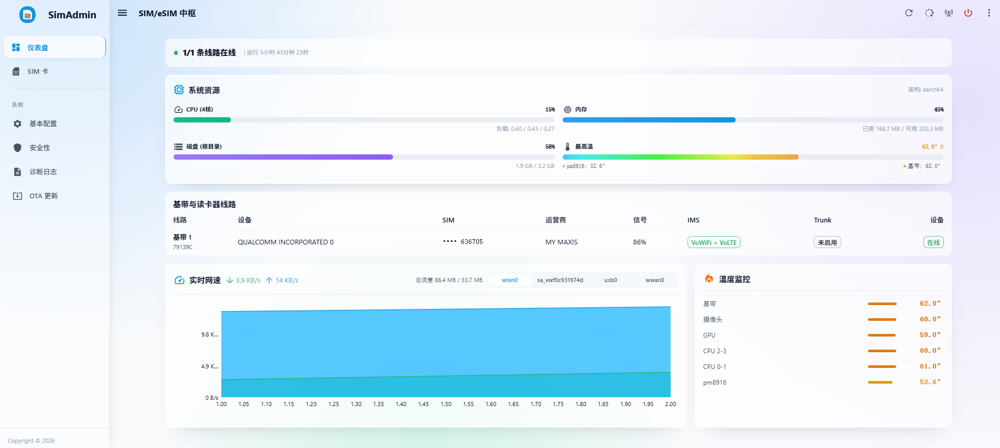
	<br/><br/>
	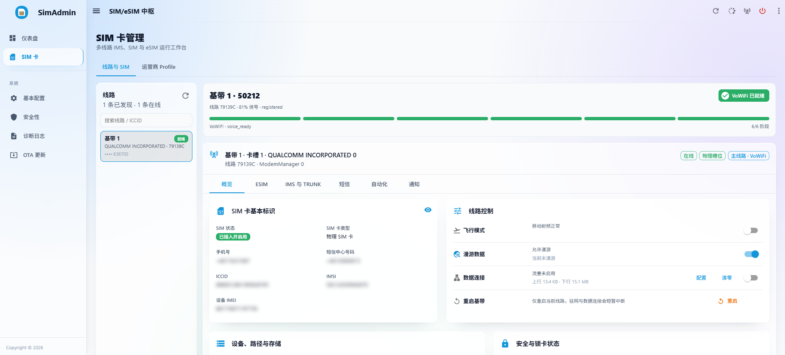
	<br/><br/>
	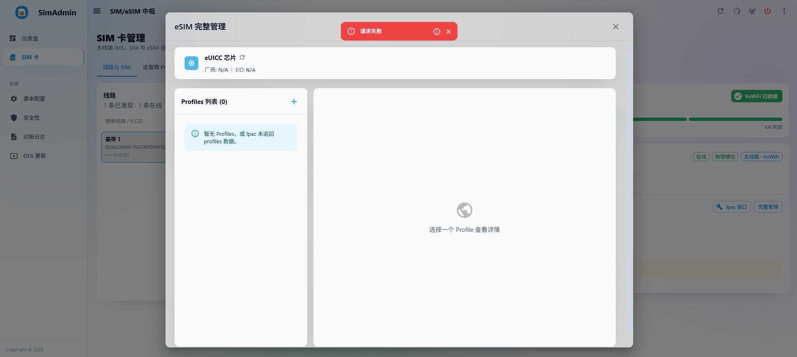
	<br/><br/>
	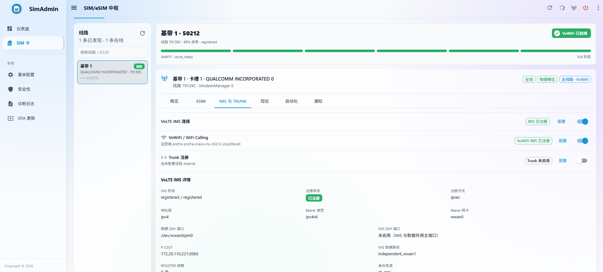
	<br/><br/>
	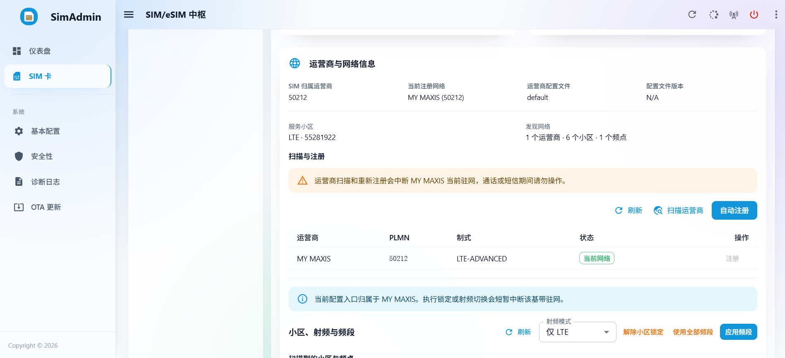
	<br/><br/>
	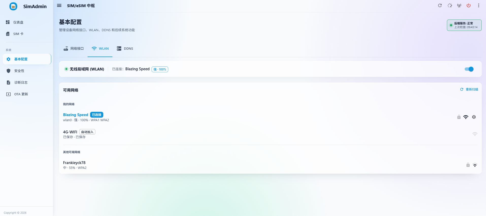
	<br/><br/>
	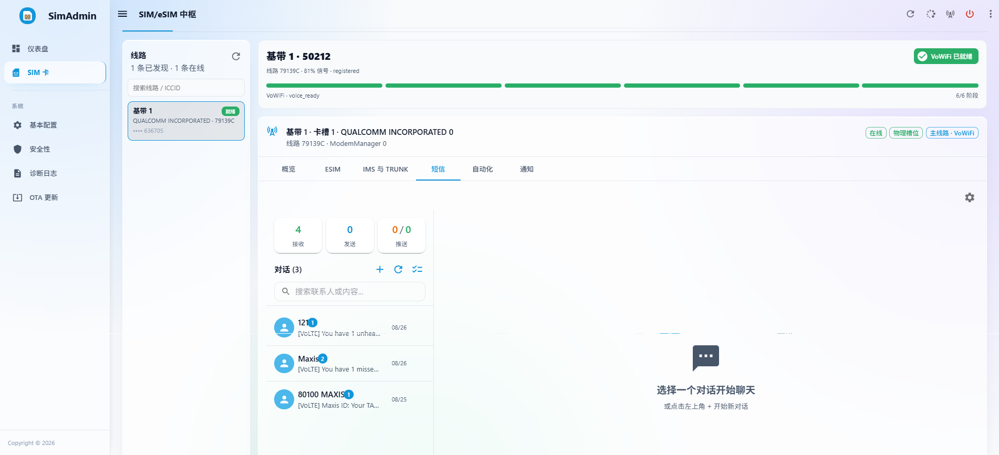
	<br/><br/>
	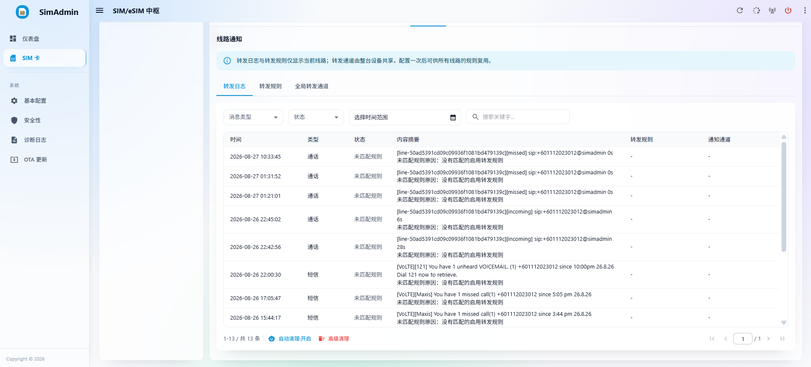
	<br/><br/>
	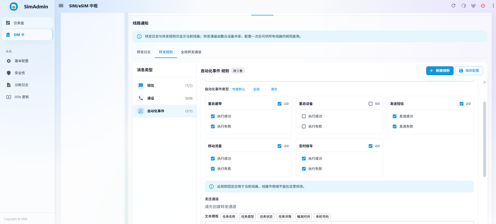
	<br/><br/>
	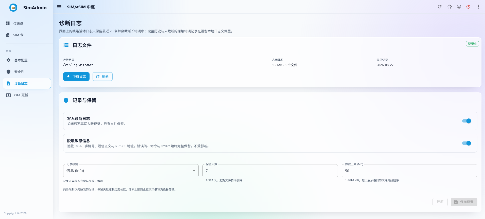
	<br/><br/>
	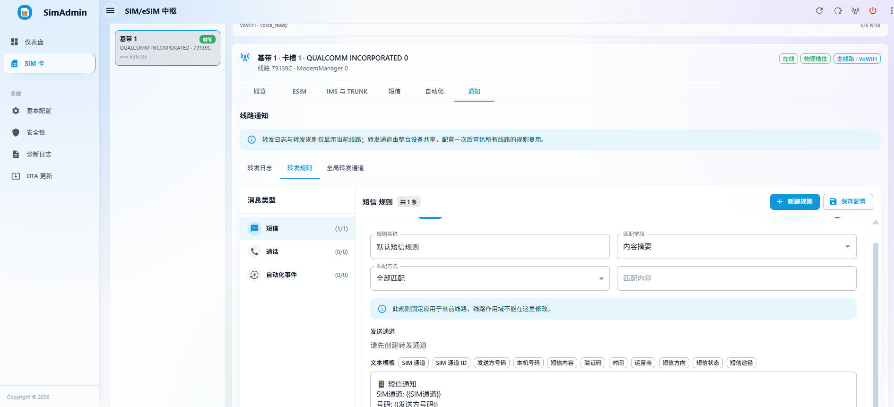
	<br/><br/>
	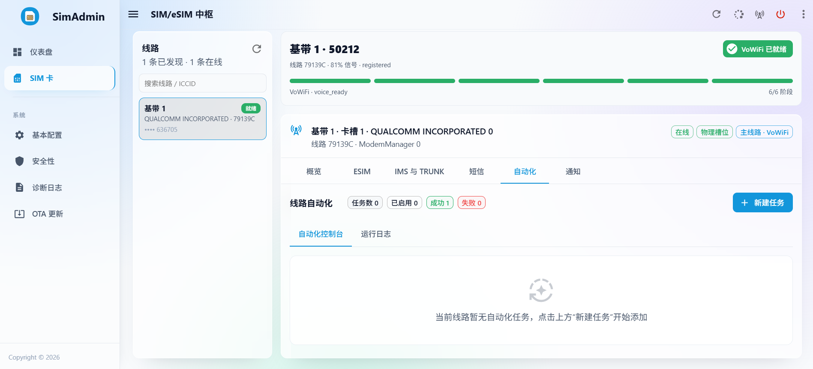
	<br/><br/>
	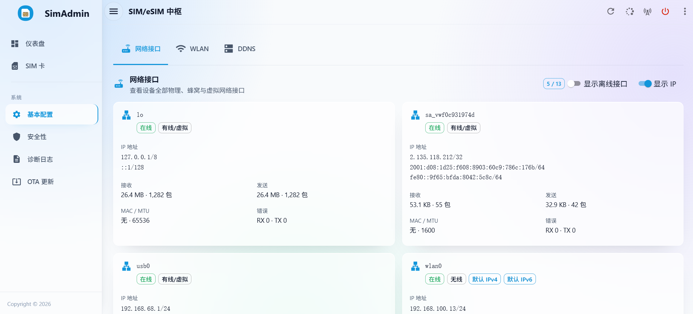
	<br/><br/>
	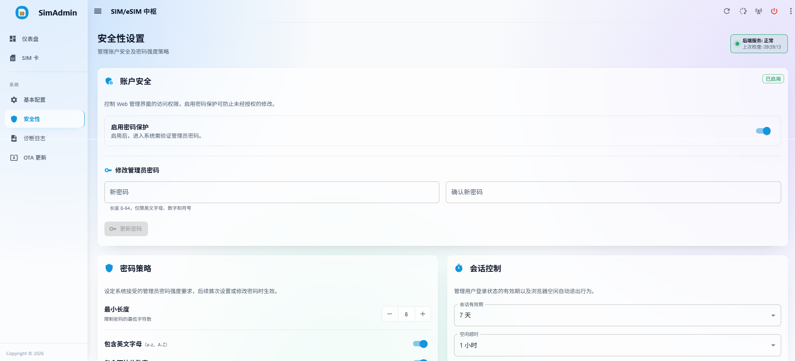
	<br/><br/>
	<!-- OTA 页面截图将在新的 OTA 流程完成后重新补充。 -->
	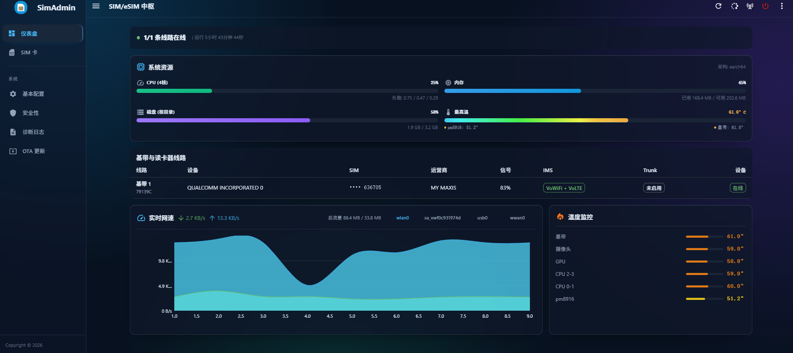
	<br/><br/>
  </picture>
  </details>


</div>

# SimAdmin - 多线路 SIM/eSIM 与 IMS 管理中枢

SimAdmin 是面向 Debian 蜂窝 CPE、随身 WiFi 和软路由设备的 Web 管理系统。它把每个
“基带 + 卡槽”建模为独立线路，在同一服务中管理 SIM/eSIM、蜂窝数据、短信、通话、
VoLTE、VoWiFi、SIP Trunk、设备网络、通知和自动化。

项目由 Rust + Axum 后端与 React + TypeScript 前端组成。后端主要通过 ModemManager
D-Bus 管理 modem，并按场景使用 QMI、AT、`mmcli`、`qmicli`、NetworkManager 和 Linux
网络栈；生产环境由同一个后端进程托管前端 SPA，默认安装到 `/opt/simadmin` 并通过
systemd 运行。

> 当前 IMS、多基带和 eSIM 能力与 modem 固件、内核驱动、运营商配置及 SIM 权限高度相关。
> “代码中提供能力”不等于所有设备均可直接使用，请在目标硬件上按真机清单验收。

## 核心能力

- **多线路隔离**：设备信息、SIM、APN、数据、漫游、飞行模式、射频/频段、运营商注册、
  VoLTE、VoWiFi、eSIM、短信和语音策略均按稳定 `line_id` 寻址与持久化。
- **多路径 IMS**：共享 SIP、Digest-AKA、短信编解码与语音核心；VoWiFi 使用内置的
  IKEv2/ESP over ePDG 用户态协议栈，VoLTE 使用独立 IMS bearer 与 Linux `ip xfrm`。
- **语音与短信编排**：短信可按线路在 VoWiFi、VoLTE、CS 之间排序与回退，IMS 语音可在
  VoWiFi、VoLTE 之间选路；同时包含接收腿选举、跨通道去重、投递记录和线路级通话控制。
- **SIP Trunk**：将线路的语音能力桥接到 Asterisk 等 SIP 端点，提供每线路配置、鉴权、
  运行状态和诊断信息。
- **eSIM/eUICC**：自动探测或按线路启停 eSIM 控制，通过私有 `lpac` 按需读取 EID、下载、
  启用、重命名和删除 Profile；支持配置独立 QMI 读卡器线路。
- **运营商 Profile**：加载只读、已封存的 carrier catalog，并允许本地覆盖；支持 AOSP APN、
  CarrierConfig 与 Apple IPCC 配置事实的导入和匹配。
- **蜂窝与设备网络**：线路级数据代理与流量统计、基带恢复、WLAN 客户端、网络接口诊断，
  以及 DNSPod、AliDNS、Cloudflare 的 IPv4/IPv6 DDNS。
- **设备运维**：短信持久化与通知转发、通知失败队列、定时/周期自动化任务、系统事件、
  单管理员认证和 SSH 密码恢复。

> 一键安装、在线升级和 OTA 发布流程正在重构，当前不提供任何远程脚本安装入口。
> 仓库中的相关脚本仅作为历史实现保留，请使用下方手动安装流程。

## 软件结构

```text
SimAdmin/
├── backend/          Rust 后端、硬件接入、IMS 协议栈和业务服务
├── frontend/         React 19 + TypeScript + MUI 管理界面
├── bruno-api/        可直接执行的 Bruno REST API 集合
├── docs/             安装、运维、开发、变更记录与专题资料
├── deploy/           设备安装资源、udev 规则和辅助 systemd 单元
├── scripts/          构建、实验室测试及待重构的部署/打包脚本
├── install_latest.sh 待重构的一键安装脚本（当前不使用）
└── uninstall.sh      待重构的卸载脚本（当前不使用）
```

后端依赖方向为 `api/services -> connectivity/hardware -> platform`：

- `connectivity/core`：与传输无关的 IMS、SIP、AKA、短信与语音核心。
- `connectivity/modems/softstack/{volte,vowifi}`：VoLTE 与 VoWiFi 接入实现。
- `hardware/{cellular,sim}`：ModemManager、QMI、AT、数据代理与 eSIM 设备操作。
- `services/{orchestrator,trunk,...}`：跨接入选路、Trunk、短信、通知、自动化、网络和 OTA。
- `platform`：配置、SQLite 与通用系统能力。

更完整的目录职责和开发流程见[开发者指南](./docs/DEVELOPER.md)。

## 手动安装

当前只支持手动部署。完成前后端构建后，将后端和前端安装到目标设备。运营商数据库是可选
组件：SimAdmin 可以在缺少 `carrier-bundles.sqlite3` 时启动，管理员随后可在 WebUI 的
“运营商 IMS Profile -> 数据库下载”中选择并安装兼容的 schema v7 数据库。

```bash
install -d -m 0755 /opt/simadmin /opt/simadmin/www
install -m 0755 /path/to/simadmin /opt/simadmin/simadmin
cp -a /path/to/frontend-dist/. /opt/simadmin/www/
install -m 0644 /path/to/simadmin.service /etc/systemd/system/simadmin.service
systemctl daemon-reload
systemctl enable --now simadmin.service
```

如需随安装包预置数据库，可额外将其放到
`/opt/simadmin/carrier-bundles.sqlite3`；否则首次启动后再从 WebUI 下载。下载会先校验数据库
契约，再原子替换当前 catalog 并立即启用，不需要重启 SimAdmin。

以上命令需在目标设备以 `root` 执行，并将 `/path/to/...` 换成实际产物路径。完整的依赖、
构建、文件传输、副 QMI 服务和升级步骤见[手动安装指南](./docs/INSTALL.md)。安装完成后访问
`http://<设备 IP>:3000`，首次打开时设置管理员密码。

## 文档导航

| 文档 | 用途 | 是否应独立维护 |
|------|------|----------------|
| [手动安装与部署](./docs/INSTALL.md) | 构建产物、手动安装、升级和登录恢复 | 是，面向最终用户 |
| [运行环境与系统管理](./docs/ENVIRONMENT.md) | 依赖、路径、systemd、数据与硬件约束 | 是，面向设备运维 |
| [架构说明](./docs/ARCHITECTURE.md) | 线路模型、前端信息架构、路由隔离、profile 选择 | 是，读代码前先看这份 |
| [开发者指南](./docs/DEVELOPER.md) | 架构、前后端开发、构建、测试、ADB 调试 | 是，前后端子 README 已归并于此 |
| [Bruno API 集合](./bruno-api/README.md) | API 调试方法、环境变量和线路级请求说明 | 是，可执行请求以 `.bru` 文件为准 |
| [未完成开发计划](./docs/DEVELOPMENT_PLAN.md) | 未完成功能、真实硬件验收和发布前门槛 | 是，当前唯一后续开发计划 |
| [版本更新记录](./docs/CHANGELOG.md) | 已发布版本的用户可见变化 | 是，不与开发计划混写 |
| [运营商 Profile 来源说明](./docs/CARRIER_PROFILES.md) | catalog、AOSP/IPCC 来源、限制与维护边界 | 是，保留为专题背景 |

已完成的 VoLTE / VoWiFi 逆向、重构和阶段性开发记录已移至同级归档仓库
`SimAdmin-Enhance`；它们不再作为本仓库的现行使用说明。

---

## 免责声明

本项目会直接操作蜂窝 modem、SIM 注册、数据拨号、APN、频段、飞行模式、NetworkManager、systemd 服务、系统重启和 OTA 文件替换；iptables/ip6tables 仅用于只读网络诊断，不会自动清空宿主机防火墙规则。

请仅在你拥有控制权的设备上使用。错误配置可能导致断网、无法注册网络、SIM 漫游计费、设备需要手动恢复，甚至 OTA 后服务无法启动。任何使用本项目造成的后果由使用者自行承担。

部分接口受硬件和 ModemManager 能力限制：

- 频段锁定依赖 ModemManager 暴露的 `SupportedBands` / `CurrentBands` / `SetCurrentBands`。
- 小区锁定当前为后端内存态展示，不会下发真实硬件锁小区命令。

## 开源协议声明

本项目采用 GNU General Public License v3.0 (GPLv3) 开源协议。

你可以：

- 自由使用、研究、修改本软件。
- 分发本软件副本。
- 分发修改后的版本。

但你必须：

1. 保留版权声明和许可证声明。
2. 分发本软件或修改版本时，以 GPLv3 协议公开完整源代码。
3. 基于本项目的衍生作品继续使用 GPLv3 协议。
4. 明确标注修改内容和修改日期。
5. 分发时附带完整 GPLv3 许可证文本。

严禁将本项目或其衍生版本闭源后作为专有软件分发。


---

## 🎖️ 鸣谢

### 👥 贡献者

- [crossgg](https://github.com/crossgg)

### 📦 参考项目

- [project-cpe](https://github.com/1orz/project-cpe)
- [SmsForwarder](https://github.com/pppscn/SmsForwarder)
- [ddns-go](https://github.com/jeessy2/ddns-go)
- [strongSwan](https://github.com/strongswan/strongswan) (VoWiFi / ePDG IPsec 隧道与 IKEv2/EAP-AKA 协议实现)
- [smoltcp](https://github.com/smoltcp-rs/smoltcp) (用户态 TCP/IP 协议栈及虚拟网关路由设计)
- [sip-core](https://github.com/snipsco/sip-core) (IMS SIP 信令解析与注册流处理)
- [Open5GS](https://github.com/open5gs/open5gs) / [free5GC](https://github.com/free5gc/free5gc) (3GPP 标准网元 ePDG/IMS 功能及域名的互操作规范)
- [AOSP CarrierConfig](https://android.googlesource.com/platform/packages/apps/CarrierConfig/) (安卓标准运营商配置与 3GPP 动态降级回退机制设计)
- [mobile-broadband-provider-info](https://gitlab.gnome.org/GNOME/mobile-broadband-provider-info) (移动宽带运营商数据匹配与基准拨号参数设计)
